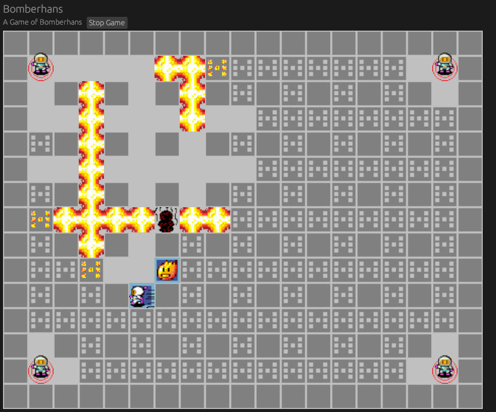

Bomberhans
==========

For a guided tour through the code see [hitchhiker.md](hitchhiker.md).

TODOS
------

*   __Networking__
*   Fit game field into Window
*   Game Modes:
    *   Destroy other's start point to win
    *   Eat schinken at center of field to win
    *   Tombstones explode with Player's schinken
    *   Tombstones give powerup's that the player lost when dying
    *   Teleports explode All other TPs
    *   Hans gets tired and needs schinken to run
    *   Eat Schinken to lose
    *   Explode Schinken to lose (set owner of subsequent bomb explosion to fire owner, so B can set a bomb in Rang of A's and a Schinken to win)

Client Server synchronization
-----------------------------

Client actions, tagged with a timestamp, are sent to server and local simulation.

Servers broadcast client actions which are legal in the server simulation

Clients are ahead of server by roughly 1 RTT. (~ 5 updates / frames).

Clients run 2 simulations. The assumed and the verified.
Actions are fed to the assumed, which is updated and drawn every tick.

When actions are received from the server, they are fed into the verified simulation.
The verified simulation is then cloned and fed all newer user actions and the 5 updates.
This produces the new assumed state, which will be rendered on the next frame

### Network Protocol Flow Diagram

#### Before the Game

*   Client Sends every Message repeatedly until Server Acknowledges

1.  Client sends Hello, Server responds with List of Lobbies and Client Cookie
2.  Client Creates / Joins a Lobby
3.  Client requests Lobby State once per second, Server responds
4.  Host (Client that opened the lobby) can change Settings
5.  Each Guest can set self as ready
6.  When all Guests ready, Host starts the Game, Server send GameStart to all clients
7.  Clients polling State of Lobby are send GameStart until they stop asking

#### Game

*   Server Maintains the current Simulation which is the single source of truth
*   Server Maintains a list of all events that happend
*   Server receives incoming events:
    *   Discard, if `last_update_time` is older than recorded
    *   Update client's last_update_time
    *   Add player's actions to queue
*   Server updates 60 times per second:
    1.  updates the simulation
    2.  Check player's reported actions
        1.  if action started at current time OR IN THE PAST
            1.  Set player state in Simulation
            2.  Add `(player, action, CURRENT_TIME)` to list of all actions
        2.  for each client, send all updates that client has not acknowledged yet

